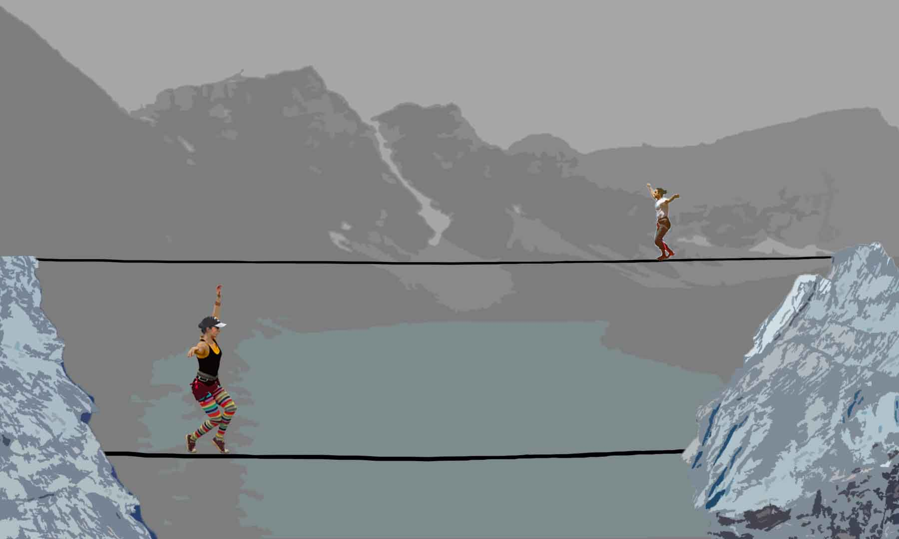

#### Delaney Wascherol
## Final project
### Title: Crossing Lines

## Concept
I would like to create a dynamic animation piece using sprites that I will create in photoshop. My plan is to animate two high-liners to walk across a line that will shift according to where the slackers are on the line. I want the background to be a p5.js generated landscape of a mountain and lake.
I don't have a particular artist or artwork that inspired this piece. I was instead inspired by photos of the American/Iranian Slackline team turned non-profit organization Crossing Lines. High-lining is a visually striking endeavor in any context, but what adds significands to crossing lines is their mission to find common ground and increase community under tense circumstances. The members of the team that I will be animating are Sonya Iverson(USA) and Kiavash Sharifi (Iran).
### Rough Sketch

## Problems to solve
The animation in this project is more intense than anything we have worked on this semester and I'm expecting that to be quite the feat. I have been watching videos on YouTube about creating sprites and it makes sense but I'm nervous about implementing ones I've made myself. I will also need to figure out how to make the line move in sync with the slackers.
### Sprite page in progress

## Deadlines
#### Monday the 30th at midnight
 I plan to have both of my sprite sheets done.

 #### Wednesday the 2nd at midnight
 I will have my background done in my sketch and be working to animate my slackers.
 #### Thursday the 3rd at midnight
 I will have my first slacker animated and will move to animate the second.
 #### Friday the 4th at midnight
 Will be done with slacker 2 and working on animating the lines.

 #### Sunday the 6th by midnight
 I will have worked out the kinks so that I'm ready to submit on Monday.

 ## Work this week
 I spent a lot of time this week figuring out how to use and make sprites. After watching several YouTube videos about it I took to Photoshop to start formatting everything. And created a rough sketch of the piece in Photoshop.
