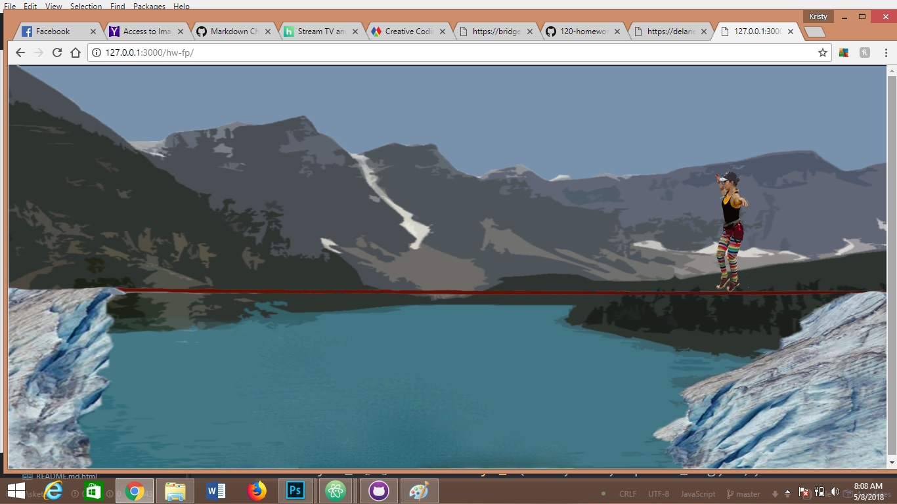

#### Delaney Wascherol
## Final project
### Title: Crossing Lines

## Concept
I would like to create a dynamic animation piece using sprites that I will create in photoshop. My plan is to animate two high-liners to walk across a line that will shift according to where the slackers are on the line. I want the background to be a p5.js generated landscape of a mountain and lake.

## Research done
It took me a ton of time to figure out how to make animate a sprite. I watched several tutorials online and read a couple of how-to tutorials but most of them weren't in p5.js so the language was confusing.

## Problems
The major problem that I can't figure out is that I can't load this out of my local server, which is frustrating because I spend about 20 hours on this animation the last 2 and a half weeks.
Here is the error code: Failed to load resource:
Sonya.png:1 Failed to load resource: net::ERR_FILE_NOT_FOUND
Sonya_2.png:1 Failed to load resource: net::ERR_FILE_NOT_FOUND
backdrop_m.png:1 Failed to load resource: net::ERR_FILE_NOT_FOUND

 ## Work
 I spent a lot of time figuring out how to use and make sprites. After watching several YouTube videos about it I took to Photoshop to start formatting everything. And created my sprite and backdrop in photoshop.
 
